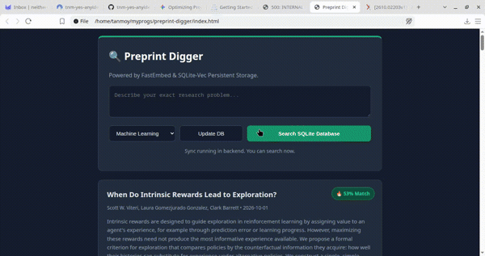

# ArXiv Semantic Radar

A zero-cost, local-first vector search engine designed to solve the noise problem in daily arXiv feeds.

Standard keyword search fails researchers because it relies on exact string matches. **Semantic Radar** downloads the daily batch of papers and uses a local embedding model (`all-MiniLM-L6-v2`) to convert abstracts into high-dimensional mathematical vectors.

Users describe their research problem in plain text, and the engine mathematically ranks the day's feed based on pure semantic meaning via Cosine Similarity.

## Demo
<!-- Replace with your FFmpeg generated GIF -->
<video src="bin/output.gif" controls="controls" muted="muted" width="100%"></video>

## Architecture
- **Vector Engine:** `sentence-transformers` running entirely on local CPU. Requires zero cloud APIs, zero OpenAI keys, and protects user research privacy.
- **Memory Profile:** Optimized for lightweight machines. The 80MB ONNX model fits easily within 8GB RAM constraints.
- **Frontend:** Vanilla JS/HTML dashboard to maintain a snappy, bloat-free UI.

## Quick Start
1. Clone the repository and navigate to the directory.
2. Install the lightweight ML dependencies:
   ```bash
   pip install flask flask-cors sentence-transformers numpy
   ```
3. Start the semantic engine (it will download the 80MB model on the first run):

    ```bash
    python3 app.py
    ```
4. Open index.html directly in your browser.
```
<div align="center">
  
</div>
```
